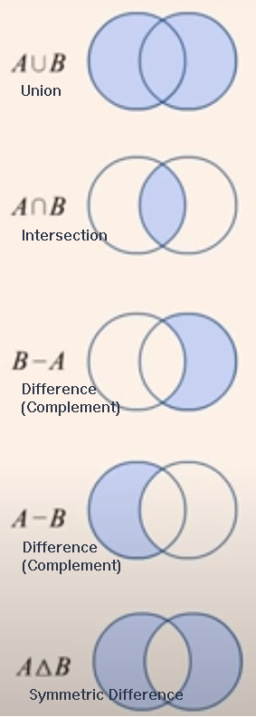
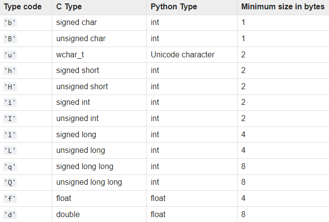

# Sets and Arrays

In this module, you will round out your knowledge of data types by looking at sets and arrays. 

## Working With Sets

If you want to perform common operations from Set Theory, such as union, intersection, and difference, you may want to use a *set* data type. In Python, sets are an unordered collection with no duplicate elements. Consider 2 sets:

```
setA = {1, 2, 4, 'A', 'B', 'D', -10, 'C'}
setB = {'B', 1, 'D', 2, 4, -10, 'A', 'C'}
```

Sets are identified by braces, `{}` but you must create an empty set with a constuctor: `setNew = set()` because the syntax 
`setNew = {}` would create a dictionary instead.

Sets can be compared with relational operators, such as equal (`!=`) and not equal (`!=`). Even though the values in `setA` are in different positions than the in the `setB`, the sets are equal they are unordered. 

This also means that you cannot access an element of a set by position; however, you can access a set by the value of an element; for example, `setA.remove(1)` to remove the value `1` in `setA`. You can also add a value; for example, `setA.add(1)` to put the value back. However, attempting the same operation on `setB` will have no effect since duplicates are not allowed and `setB` already has the value `1` in it. 

You can traverse the elements of a set in the same manner as other collections:

```
for x in b:
   print(x)
```

Being able to add and remove elements also means that a set is mutable and can be changed; however, the elements in a set must be immutable, meaning the elements themselves cannot be changed.

### Operations on Sets

The following diagram shows some common set operations:


For these examples, given that set `a` contains {1, 2, 4, -10} and set `b` contains {'A', 'B', 'D', -10, 'C'}, consider the following lines of code:
#### Union
```
a.union(b)
b.union(a)
```
`a` union `b` gives `{1, 2, 4, 'A', 'B', 'D', -10, 'C'}`.

`b` union `a` gives `{'B', 1, 'D', 2, 4, -10, 'A', 'C'}`.

The resulting sets are equal.
#### Intersection
```
a.intersection(b)
b.intersection(a)
```
`a` intersection `b` gives `{-10}`, as does `b` intersection `a`. The resulting sets are equal.
#### Difference and Complement
```
a.union(b).difference(a)
a.difference(b)
a - b
```
The 3 operations above give `{'B', 'D', 'C', 'A'}`. The resulting sets are equal.
```
b.union(a).difference(b)
b.difference(a)
b - a
```
The 3 operations above give `{1, 2, 4}`. The resulting sets are equal.
#### Symmetric Difference
```
a.symmetric_difference(b)
b.symmetric_difference(a)
```
`a.symmetric_difference(b)` gives `{1, 2, 4, 'C', 'B', 'D', 'A'}`.

`b.symmetric_difference(a)` gives `{1, 2, 4, 'D', 'A', 'C', 'B'}`.

The resulting sets are equal.
#### Other Operations
There are several other operations you can perform on sets, such as determining whether a set is a subset or superset of another set or updating a set in place after performing one of the above operations, etc. For more information and examples, see 
[Python Set Methods](https://www.w3schools.com/python/python_ref_set.asp).

### Removing Duplicate Vales From Lists
The "silent" removal of duplicate values can be useful if that is what you want to do. Consider the following example that removes duplicate elements from a list:
```
list1 = ["A","B","A","B","D","C","B"]
b = set(l1)
list2 = list(b)
```
The *cast* performed by `set` changes the list into a set and the cast performed by `list` changes the set back into a list without the duplicate values: 'C', 'D', 'B', and 'A'.

## Working With Arrays
An array is a collection of elements, whose values are indexed. Unlike other programming languages, arrays are not built into core Python. For cases in which the number of data elements to manipulate is fairly small, you would simply use a list. 

For a larger number of elements in a 1-dimension array, called a *vector* in mathematics, you can use the array module. A *module* is an add-on to the Python language; you will see later that you can also create your own modules to help organize and share your code.

The array module is briefly introduced here; however, if you are working with multidimensional arrays required by scientific applications or data science, you most likely will use the NumPy add-on module, which is introduced later, or perhaps use SciPy, which builds on NumPy, or use other more specialized modules.

The array module improves computational performance by restricting the data elements to a single type that you must specify when creating an array; otherwise, you can perform  operations on an array in the same way you would a list.

The array module supports the following C-language basic data types:


At the top of your file, you must import the `array` module:
```
import array
```
Then, in a function your or your main program, you can create an array by specifying the type code and the initializer:
```
arr = array.array('i', [10, 20, 30, 40])
```
Note the `array.array` syntax. The first `array` is the module name, and the second one, `array(...)` is the constructor. The type code and list are arguments to the array. When working with modules, you must always prefix its contents, like a function or constructor, with the module name.


